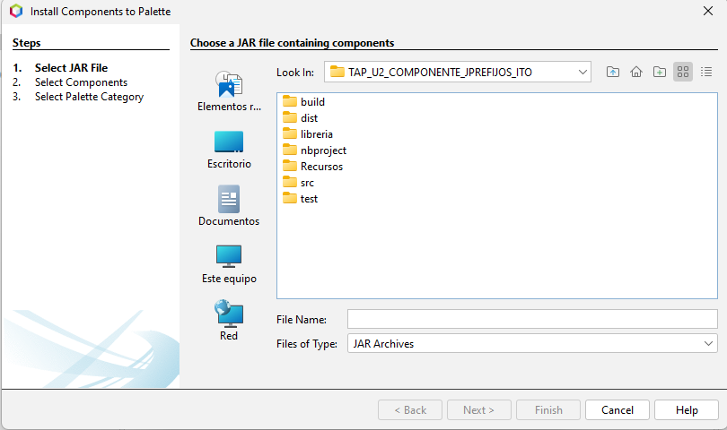
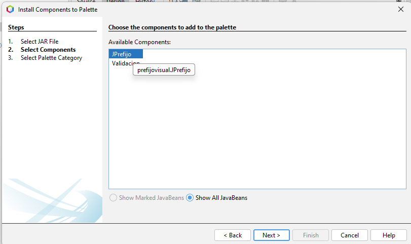

# Componente JPrefijos

## Descripcion del componenete
Este componente visual de Java se basa en un validador de ladas de algunos paises del mundo, es decir a la hora de seleccionar tu Pais, aparecera tu lada y la bandera de dicho Pais. Está diseñado para ser utilizado en aplicaciones compatibles con Java Swing, pudiendo ser añadido fácilmente a `JFrame` o `JDialog`.

## Usos
- **Aplicaciones moviles de agenda telefonica**: Nuestro componente podria ser implementado en cualquier app de agendas telefonicas, para llevar un registro de todos los numeros telefonicos.
- **Portales de servicios de mensajería y envíos**: De igual forma puede ser implementado en los servicios de mensajeria y envios, ya que es primordial el uso de tu pais, y numero telefonico como medio de contacto.
- **Sitios de compra y venta de productos en línea**: Otra implementacion seria en los sitios de compra y venta en linea, al emplearse un medio de contacto, y como sabemos el numero telefonico es el medio de contacto mas comun.
- **Formularios de registros**: La forma mas comun de la implementacion de nuestro componente son los formularios de registros.

## Caracteristicas
- Permite mostrarnos la bandera y lada del pais seleccionado, asi como registrar nuestro numero.
- Puede ser implementado en la Paleta de Apache Netbeans.
- Es un elemento visual muy llamativo que permite modificar sus propiedades (color de fondo, añadir mas paises).
- Facil uso del componente.

## Requisitos
- Java JDK 20 o superior
- IDE con soporte para Swing si se desea visualizar el componente gráficamente ( NetBeans o IntelliJ IDEA).

## API
### Pais
### Descripcion
La clase `Pais` es utilizada para construir nuestros objetos de tipo *Pais*, no tiene como tal otra funcion en especifico.
#### Variables
| Tipo | Nombre de la variable| Descripción |
|------|-------|-------------|
| `String` | `nombre` | Se utiliza para guardar el nombre del Pais. |
| `String` | `lada` | Es utilizada para guardar la lada del Pais. |

#### Constructor
| Constructor | Descripción |
|-------------|-------------|
| `Pais()` | El constructor recibe dos parametros (nombre, lada) y se inicializa la clase. |

#### Metodos
| Nombre | Dato retornado | Parametro | Descripción |
|--------|--------|-------------------------|-------------|
| `getNombre()` | `String` | `null ` | Retorna nuestra variable nombre. |
| `setNombre()` | `void` | `String ` | Modifica nuestra variable nombre y le asigna el String que recibe. |
| `getLada()` | `String` | `null` | Retorna nuestra variable lada. |
| `setLada()` | `void` | `String ` | Modifica nuestra variable lada y le asigna el String que recibe. |
| `toString()` | `String` | `null` | Retorna nuestras variables concatenadas. |

### Validacion
### Descripcion
La clase `Validacion` se utiliza como herramienta para que nuestro componente funcione adecuadamente. y no se puedan ingresar letras a nuestro *TextField*.
#### Metodos
| Nombre | Dato retornado | Parametro | Descripción |
|--------|--------|-------------------------|-------------|
| `vcontra()` | `boolean` | `String` | Valida que el String ingresado como parametro no contenga letras. |
| `vnumero()` | `boolean` | `String ` | Valida que nuestro String ingresado como parametro sea de 10 digitos. |


### JPrefijo
### Descripcion
La clase `JPrefijo` es el componente visual que implementaremos a nuestro IDE, para ello es importante conocer su estructura.

#### Variables
| Tipo | Nombre de la variable| Descripción |
|------|-------|-------------|
| `ArrayList<Pais>` | `pa` | Se utiliza para guardar el nombre del Pais. |
| `String` | `lada` | Es utilizada para guardar la lada del Pais. |
| `Validacion` | `v` | Es un objeto creado para poder utilizar sus metodos de validacion. |
Esas son las variables globales de la clase, pero tambien existen otras varibles que son locales y empleadas en metodos en especifico como es:
- La variable `String "ruta"` esta variable se emplea para guardar la ruta de nuestro archivo, pero esa ruta ya no tiene que ser modificada, ya que se emplea una ruta relativa para evitar cambiar de rutas.

#### Constructor
| Constructor | Descripción |
|-------------|-------------|
| `JPrefijo()` | Este metodo inicializa todos los componentes necesarios para nuestro proyecto, ademas de inicializar la ejecucion de los metodos empleados. |

#### Metodos
| Nombre | Dato retornado | Parametro | Descripción |
|--------|--------|-------------------------|-------------|
| `colorCaja()` | `void` | `Color` | Nos permite modificar el color de fondo del componente. |
| `txtNumerotelActionPerformed()` | `void` | `java.awt.event.ActionEvent evt` | Valida lo que ingresemos en el textField. |
| `cboPrefijosActionPerformed()` | `void` | `java.awt.event.ActionEvent evt` | Ejecuta el metodo `validarB()`. |
| `txtNumerotelKeyTyped()` | `void` | `java.awt.event.KeyEvent evt` | No permite que se muestren otros caracteres aparte de numeros. |
| `getPais()` | `String` | `null` | Nos devuelve un String con el nombre seleccionado del comboBox. |
| `getCombo()` | `String` | `null` | Nos devuelve un String con la lada que se muestra en la etiqueta. |
| `getNumero()` | `String` | `null` | Nos devuelve un String con el numero ingresado en el textField. |
| `setNumero()` | `void` | `String` | Nos permite modificar el contenido del textField. |

## Instalacion
Para poder instalar y utilizar el componente `JPrefijos` es necesario seguir estos pasos:
1.  Obtener un clone del repositorio con el siguiente comando:
```bash
git clone https://github.com/Eduardo-Solano/TAP_U2_COMPONENTE_JPREFIJOS_ITO.git
```
De igual forma puedes descargarlo en formato `ZIP`


2. Abre tu proyecto en el IDE que gustes.
3. Verifica que compile sin errores.
4. En caso de que te marque algun error relacionado con el JDK, asegurate de estar utilizando un JDK 20 o superior.
5. Si utilizas un JKD superior y quieres cambiar el JDK del proyecto realiza lo siguientes puntos:
- Da clic derecho sobre el proyecto y dirigete hacia sus propiedades.

- Luego en la parte de abajo da un clic sobre donde aparece JDK 20 y cambialo al mas reciente que te aparece.

6. Si utilizas un JDK inferior a 20, aqui te dejo un video tutorial de como cambiar el JDK de tu proyecto.

   Link del video: https://youtu.be/j7ACYObJNtw?si=bp-nwU7BnsJabt2S

7. En ocasiones Netbeans te arrojara un mensaje el cual dice que para compilar el proyecto debes actualizar tu JDK, en ese caso actualizalo.

## Como implementarlo a la paleta de NetBeans
1. Debes asegurarte que tu proyecto este compilado.
2. Una vez compilado no es necesario crear el JAR por que ya viene incluido.
3. Dale clic derecho sobre la paleta de NetBeans y selecciona Palette Manager.


4. Nos aparecera un cuadro de dialogo, le damos clic en la primera opcion *Add from JAR*


5. Ahi buscamos nuestro proyecto y entramos en el.


6. Ahora seleccionaremos el `.JAR` que se encuentra dentro de la carpeta dist y damos siguiente.


7. Despues seleccionamos JPrefijo que es nuestro componente  y le damos siguiente.


8. Ahora solo seleccionamos en que apartado queremos que se muestre e componente, en mi caso elegi *Beans*.


9. Y probamos nuestro nuevo componente.

## Funcionamiento
En el siguiente link encontraras el funcionamiento y uso del componente JPrefijo:

Da clic para ver: https://youtu.be/fMSMEly1XxI?si=2NwE1OBVm4rebtPH

## ¡NOTA!
Recuerda que para implementar este componente en cualquier proyecto debes tener encuenta lo siguiente:
- Si deseas guardar el valor que contiene el textField tienes que mandar a ejecutar el metodo `getNumero()`. 
Ejemplo: `String numero`= nombre_del_componente.`getNumero()`.

- Si deseas guardar el valor que contiene seleccionado por el comboBox tienes que mandar a ejecutar el metodo `getPais()`. 
Ejemplo: `String pais`= nombre_del_componente.`getPais()`.

- Si deseas guardar el valor que contiene la Lada tienes que mandar a ejecutar el metodo `getCombo()`. 
Ejemplo: `String lada`= nombre_del_componente.`getCombo()`.

## Autores
- *Eduardo Solano Ramos*- Contacto: [Eduardo-Solano (github.com)]
- *Jesus Abraham Mendoza Chavez*-Contacto: [Jesus18902 (github.com)]
